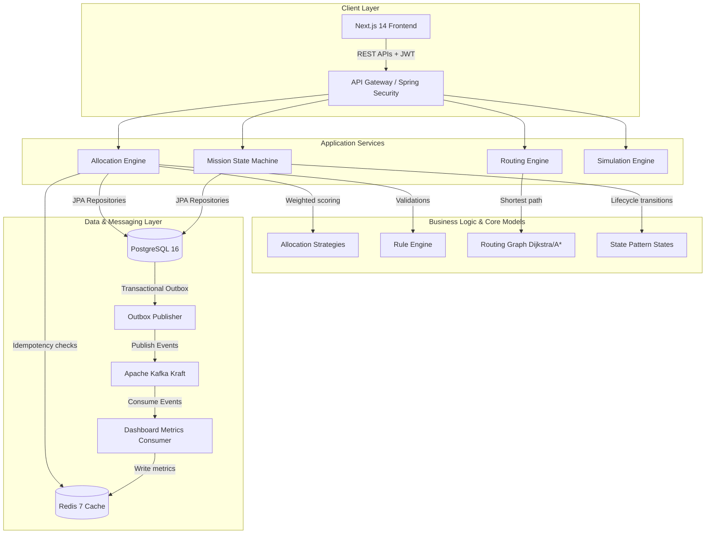

# RESQFLOW - Disaster Logistics & Emergency Resource Allocation Platform

ResQFlow is an enterprise-grade, high-concurrency disaster response logistics system designed to automate emergency request parsing, optimal resource allocation, and dynamic vehicle transit routing under real-world disaster conditions (e.g. road blockages, flooding, and vehicle storage limits).

This platform acts as a showcase of **Advanced Object-Oriented Programming (OOP)**, **SOLID principles**, **clean architecture**, **distributed transactional consistency**, and **complex data structures & algorithms (DSA)**.

---

## 🏗️ System Architecture



---

## 🚀 Key Functional Modules

1. **Rule Engine & Allocation Strategies**:
   - Parses incoming requests (Food, Water, Medical, Shelter, Equipment).
   - Validates constraints (Capacity, Vehicle Compatibility, Medical Storage Temperature, Expiry Deadlines) via a decoupled [RuleEngine](file:///c:/Users/Sneha/projects/ResQFlow/backend/src/main/java/com/resqflow/application/rules/RuleEngine.java).
   - Allocates materials using the **Strategy Pattern** ([AllocationStrategy](file:///c:/Users/Sneha/projects/ResQFlow/backend/src/main/java/com/resqflow/application/strategy/AllocationStrategy.java)). Strategies include `HybridAllocationStrategy` (weighing expiration vs proximity) and `FairDistributionStrategy`.

2. **Dijkstra & A\* Pathfinding**:
   - Represents road networks as a custom [RoutingGraph](file:///c:/Users/Sneha/projects/ResQFlow/backend/src/main/java/com/resqflow/application/routing/RoutingGraph.java) in memory.
   - Computes path coordinates and travel times using Dijkstra ($O((V+E)\log V)$) or $A^*$ path heuristics.
   - Detects blockages and routes transit vehicles dynamically.

3. **Mission State Machine & Incident Rerouting**:
   - Transition states strictly govern the vehicle lifecycle: `CREATED` $\rightarrow$ `DISPATCHED` $\rightarrow$ `IN_TRANSIT` $\rightarrow$ `DELIVERED`.
   - If a road segment becomes `BLOCKED`, the [IncidentService](file:///c:/Users/Sneha/projects/ResQFlow/backend/src/main/java/com/resqflow/application/service/IncidentService.java) automatically recalculates and triggers a dynamic reroute for all affected active transit vehicles.

4. **Transactional Outbox Event Streaming**:
   - Operations edit database state and write events to `outbox_events` within the same database transaction.
   - A background thread streams outbox records to Apache Kafka.
   - Asynchronous consumers write audit logs and update Redis caches to render real-time dashboard counts.

---

## ⚡ Concurrency & Lock Strategy

To prevent two coordinators from double-allocating the same resource:
- Every `Resource` and `Vehicle` has a `@Version` Optimistic Lock.
- Overlapping requests cause a transaction rollback, throwing `ObjectOptimisticLockingFailureException` mapped to HTTP `409 Conflict`.
- Requests contain UUID `Idempotency-Key` headers checked and cached in Redis.

---

## 📊 Algorithmic Complexity

| Algorithm | Average Time Complexity | Space Complexity | Usage |
| :--- | :--- | :--- | :--- |
| **Dijkstra** | $O((V + E) \log V)$ | $O(V + E)$ | Hardest-path routing bypassing blocked roads |
| **A\*** Heuristic | $O(V \log V)$ | $O(V)$ | Optimal proximity-based pathfinding |
| **Priority Queue** | $O(N \log N)$ (sorting) | $O(N)$ | Request severity scheduling priority |

---

## 🛠️ Developer Setup & Orchestration

### Prerequisites
- Docker & Docker Compose
- JDK 17
- Node.js 20

### Steps
1. **Launch Containers** (PostgreSQL, Redis, Kafka):
   ```bash
   docker-compose up -d
   ```
2. **Start Backend**:
   ```bash
   cd backend
   mvn spring-boot:run
   ```
3. **Start Frontend**:
   ```bash
   cd frontend
   npm install
   npm run dev
   ```

### Quick Access Credentials
- **Admin**: `admin@resqflow.com` / `password`
- **Coordinator**: `coordinator@resqflow.com` / `password`
